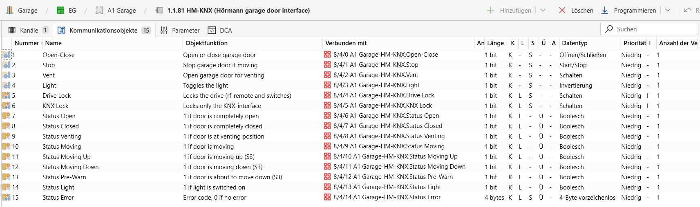
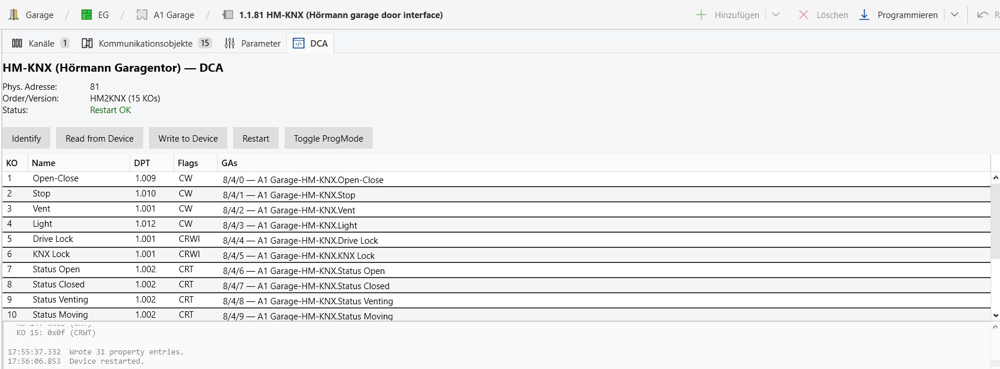

HM-KNX
===

ETS-Integration für das Hörmann/Ing.-Budde **HM-KNX** Garagentor-Gateway
(Hersteller 0x4805): die ETS-Produktdatei (knxprod) sowie die optionale
ETS6-DCA-AddIn-Oberfläche, erstellt mit der
[OpenKNX](https://github.com/OpenKNX)-Toolchain.

> Die knxprod ist **dokumentationsorientiert**: Die HM-KNX-Firmware implementiert
> keine Standard-LoadProcedure (Maske 0x0021). ETS programmiert das Gerät darüber
> nicht - die Datei stellt das Gerät lediglich mit korrekten Gruppenobjekt-Namen,
> DPTs und Flags in ETS dar, sodass Gruppenadressen visuell zugewiesen werden
> können.

Damit erscheint das Gerät in ETS mit benannten Gruppenobjekten; die optionale
DCA-Oberfläche liest und schreibt die KO-Konfiguration direkt aus ETS.


*ETS-Ansicht „Kommunikationsobjekte": benannte KOs mit DPTs, Flags und Gruppenadressen (aus der knxprod).*


*Optionaler DCA-Tab: Identify, Lesen/Schreiben der KO-Konfiguration, Neustart und ProgMode direkt aus ETS.*

## Inhalt

- `knxprod/HM-KNX.xml` - selbstständige Quell-XML der ETS-Produktdatei (Catalog,
  Hardware und ApplicationProgram in einer Datei)
- `dca/` - C#-Quellen der ETS6-DCA-AddIn (.NET Framework 4.8)
- `scripts/sideload-dca.ps1` - installiert die AddIn in ETS6
- `scripts/openssl-sha1.cnf` - OpenSSL-Konfiguration für das Signieren unter Linux
- `tools/hmknxctl.py` - eigenständiges Python-CLI, das die Geräte-Konfiguration
  direkt über KNXnet/IP liest und schreibt (ohne ETS)

## Voraussetzungen

Neben ETS6 werden zwei Werkzeuge benötigt: ein .NET SDK (zum Kompilieren der DCA)
und der OpenKNXproducer (erzeugt und signiert die knxprod). Alle Beispiele unten
gehen von einer **PowerShell**-Konsole im Wurzelverzeichnis dieses Repos aus.

### ETS6

Liefert die DLLs, mit denen die knxprod signiert wird (`Knx.Ets.XmlSigning.dll`).
Standard-Installationspfad: `C:\Program Files (x86)\ETS6\`.

### .NET SDK (nur für den Bau der DCA)

Der OpenKNXproducer bringt seine eigene Runtime mit; ein .NET SDK wird **nur**
zum Kompilieren der DCA gebraucht. Installation z.B. per winget:

```powershell
winget install Microsoft.DotNet.SDK.8
```

Alternativ der Installer von <https://dotnet.microsoft.com/download>. Es genügt
ein beliebiges aktuelles SDK (getestet mit .NET 8). Visual Studio oder das
.NET-Framework-4.8-Targeting-Pack sind **nicht** nötig: die passenden
Referenz-Assemblies zieht der Build automatisch als NuGet-Paket
(`Microsoft.NETFramework.ReferenceAssemblies`). Dafür ist beim ersten Build eine
Internetverbindung erforderlich.

### OpenKNXproducer (externes Release)

Das Werkzeug erzeugt aus der XML die knxprod und signiert sie. Es ist externer
Code und wird als fertiges Release bezogen (getestet mit **v4.3.9**):

1. Release-ZIP von <https://github.com/OpenKNX/OpenKNXproducer/releases> laden und
   vollständig entpacken.
2. Im entpackten Ordner den Installer ausführen (Rechtsklick auf
   `Install-OpenKNX-Tools.ps1` -> "Mit PowerShell ausführen", oder in einer
   PowerShell-Konsole):

   ```powershell
   PowerShell -ExecutionPolicy Bypass -File .\Install-OpenKNX-Tools.ps1
   ```

   Der Installer kopiert eine self-contained `OpenKNXproducer.exe` nach
   `%USERPROFILE%\bin\`. Dieser Ordner liegt **nicht** automatisch im PATH; die
   Beispiele unten rufen die EXE daher mit vollem Pfad auf. Wer den Aufruf
   verkürzen will, fügt `%USERPROFILE%\bin` einmalig zur PATH-Umgebungsvariable
   hinzu.

> **PowerShell-Ausführungsrichtlinie:** Die `.ps1`-Skripte hier sind nicht
> signiert und werden daher wie gezeigt mit
> `PowerShell -ExecutionPolicy Bypass -File <skript>` gestartet.

## knxprod bauen

```powershell
& "$env:USERPROFILE\bin\OpenKNXproducer.exe" knxprod -o HM-KNX.knxprod knxprod\HM-KNX.xml
```

Unter Windows ist keine zusätzliche Konfiguration nötig; die EXE signiert über die
installierten ETS-DLLs. Die erzeugte `HM-KNX.knxprod` wird in ETS unter
*Kataloge -> Importieren* eingelesen.

Unter Linux/macOS heißt das installierte Werkzeug `OpenKNXproducer` (ohne `.exe`,
abgelegt unter `/usr/local/bin`). Dort blockiert die System-Krypto-Richtlinie
(OpenSSL 3) das von ETS verwendete RSA-SHA1-Signieren; die mitgelieferte
OpenSSL-Konfiguration aktiviert es pro Prozess:

```bash
OPENSSL_CONF=scripts/openssl-sha1.cnf \
  OpenKNXproducer knxprod -o HM-KNX.knxprod knxprod/HM-KNX.xml
```

### Hinweis zur Applikations-ID (DCA)

Beim Signieren ersetzt ETS das letzte Segment der Applikations-ID durch einen
Inhalts-Hash (für die mitgelieferte `HM-KNX.xml`: `M-00FA_A-4805-05-0D9F`). Das
DCA-Manifest (`dca/AddInManifest.xml`) verweist über die `ApplicationProgram Id`
auf diese Applikation.

ETS ordnet die DCA dem Gerät **ohne** dieses Hash-Segment zu (Präfix-Vergleich
`M-00FA_A-4805-05`): die Manifest-ID muss nur mit diesem Präfix beginnen. Ein
Neubau der `HM-KNX.xml` mit anderer ETS-Version ändert nur den Hash und macht
daher **keine** Anpassung des Manifests nötig. Nur wenn sich **AppNummer** (4805)
oder **Applikationsversion** (05) ändern, muss die ID im Manifest mitgezogen
werden.

## DCA bauen & installieren

Die DCA-AddIn ergänzt im ETS einen Konfigurations-Tab für das Gerät.

1. Bauen (benötigt das .NET SDK aus den Voraussetzungen):

   ```powershell
   dotnet build -c Release dca\HM-KNX.Dca.csproj
   ```

2. Installieren (Sideload). Das Skript kopiert DLL + Manifest in das
   ETS6-AddIns-Verzeichnis und signiert den AddIn-Ordner mit dem Signierer der
   installierten ETS (`Knx.Ets.XmlSigning.dll` - derselbe, der auch die knxprod
   signiert; kein privater Schlüssel nötig):

   ```powershell
   # ETS6 vorher schließen!
   PowerShell -ExecutionPolicy Bypass -File .\scripts\sideload-dca.ps1
   ```

   Liegt die ETS nicht unter dem Standardpfad, den Pfad angeben:
   `… -File .\scripts\sideload-dca.ps1 -EtsPath "D:\ETS6"`.

   Die Signatur ist **optional**: Auf einer lizenzierten ETS erscheint der
   DCA-Tab auch ohne sie; sie sorgt nur dafür, dass ETS die App als signiert
   führt (wie die Hersteller-Apps). Findet das Skript keine ETS-DLL,
   installiert es unsigniert weiter.

   **Der DCA-Tab erscheint nur in einer lizenzierten ETS** (Lite / Home /
   Professional). Die **ETS Demo** blendet DCA-Tabs grundsätzlich für *alle*
   Geräte aus - das ist eine ETS-Einschränkung, nicht ein Problem der App; eine
   eigene KNX-Lizenz braucht die App nicht (sie ist Freeware). Erscheint der Tab
   nicht: prüfen, dass das Gerät (nicht der Gebäude-Knoten) ausgewählt ist, und
   ETS6 einmal neu starten.

## Verwendung: Gerät programmieren

Das Gerät wird **nicht** über den gewohnten ETS-Download programmiert (die
Firmware mit Maske 0x0021 kennt die Standard-LoadProcedure nicht). Die
Gruppenadressen kommen stattdessen über den DCA-Tab aufs Gerät:

1. **Gruppenadressen zuweisen** - in der ETS-Ansicht „Kommunikationsobjekte"
   den KOs die Gruppenadressen zuordnen, genau wie bei jedem anderen Gerät. Sie
   erscheinen anschließend automatisch in der Spalte „GAs" des DCA-Tabs. In der
   DCA selbst lassen sich **keine** GAs eintippen - die Liste dient nur der
   Anzeige.
2. **Auf das Gerät schreiben** - im DCA-Tab auf **„Write to Device"**. Das
   überträgt die Gruppenadressen samt Flags auf das Gerät und ist damit der
   eigentliche „Download" für dieses Gerät. Voraussetzung: Die Busverbindung in
   ETS ist online und das Gerät ist unter seiner phys. Adresse erreichbar.

Die weiteren Knöpfe im Tab:

- **Read from Device** liest nur die KO-**Flags** zur Kontrolle zurück, **nicht**
  die Gruppenadressen. Die GA-Spalte stammt also immer aus dem ETS-Projekt; eine
  leere Spalte bedeutet lediglich, dass dem Gerät in ETS noch keine
  Gruppenadressen zugewiesen sind.
- **Identify** liest die Geräte-Kennung aus (Hersteller, Seriennummer,
  Order-Info, Applikationsversion).
- **Restart** startet das Gerät neu, **Toggle ProgMode** schaltet den
  Programmiermodus um.

Die Ausgabe jeder Aktion erscheint im Log-Feld unten im Tab.

## hmknxctl - Konfiguration per Kommandozeile lesen/schreiben

Unter `tools/hmknxctl.py` liegt ein eigenständiges Python-Tool, das die
KO-Konfiguration des Geräts **direkt über einen KNXnet/IP-Tunnel** liest und
schreibt - ohne ETS. Damit lässt sich insbesondere die **aktuell im Gerät
gespeicherte Konfiguration auslesen** (inklusive Gruppenadressen). Das kann die
DCA nicht: Die Antwort-Telegramme dieser Firmware werden vom KNX-Stack der ETS
(Falcon) als „out of sequence" verworfen. Das Tool spricht stattdessen über
[xknx](https://github.com/XKNX/xknx) und hat diese Einschränkung nicht.

Voraussetzungen: Python 3 sowie `xknx` und `PyYAML`:

```bash
pip install xknx pyyaml
```

Beispiele (Gateway-IP und phys. Adresse an die eigene Anlage anpassen):

```bash
# Gerätekennung anzeigen
python3 tools/hmknxctl.py -g 192.168.1.10 -d 1.1.5 identify

# Komplette Konfiguration aus dem Gerät lesen (als YAML)
python3 tools/hmknxctl.py -g 192.168.1.10 -d 1.1.5 read -o config.yaml

# Konfiguration aus YAML schreiben - erst als Trockenlauf prüfen
python3 tools/hmknxctl.py -g 192.168.1.10 -d 1.1.5 write -c config.yaml --dry-run
```

Weitere Unterbefehle: `find` (Geräte im Programmiermodus suchen), `set-pa`
(phys. Adresse programmieren), `progmode`, `restart`, `dump-raw`. `-g` und `-d`
sind Pflicht (außer bei `find`, das kein Zielgerät braucht).
